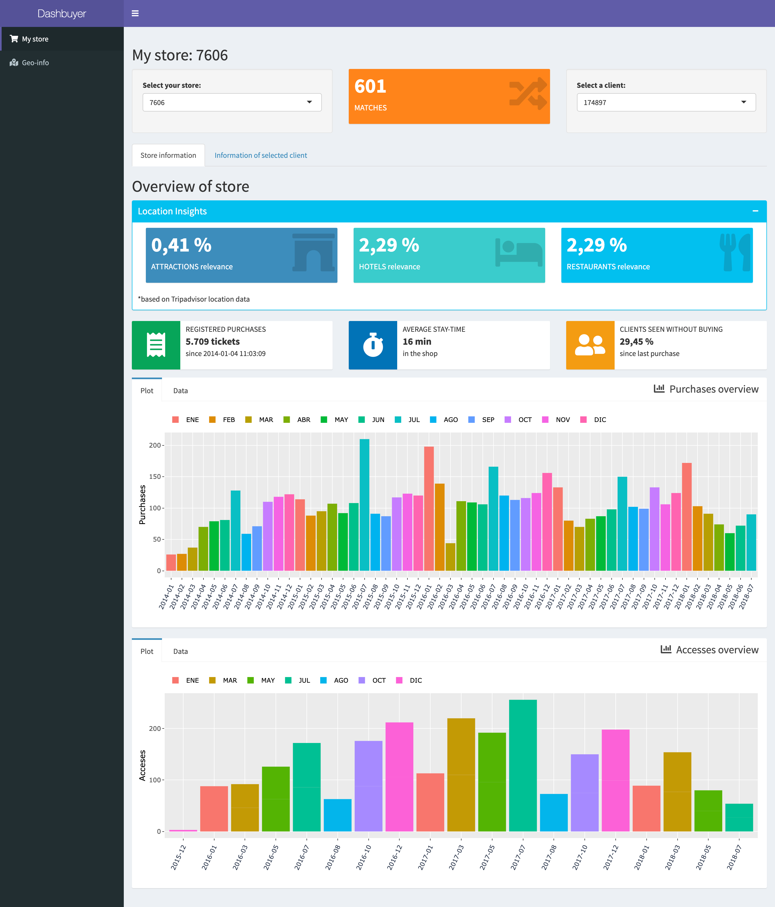
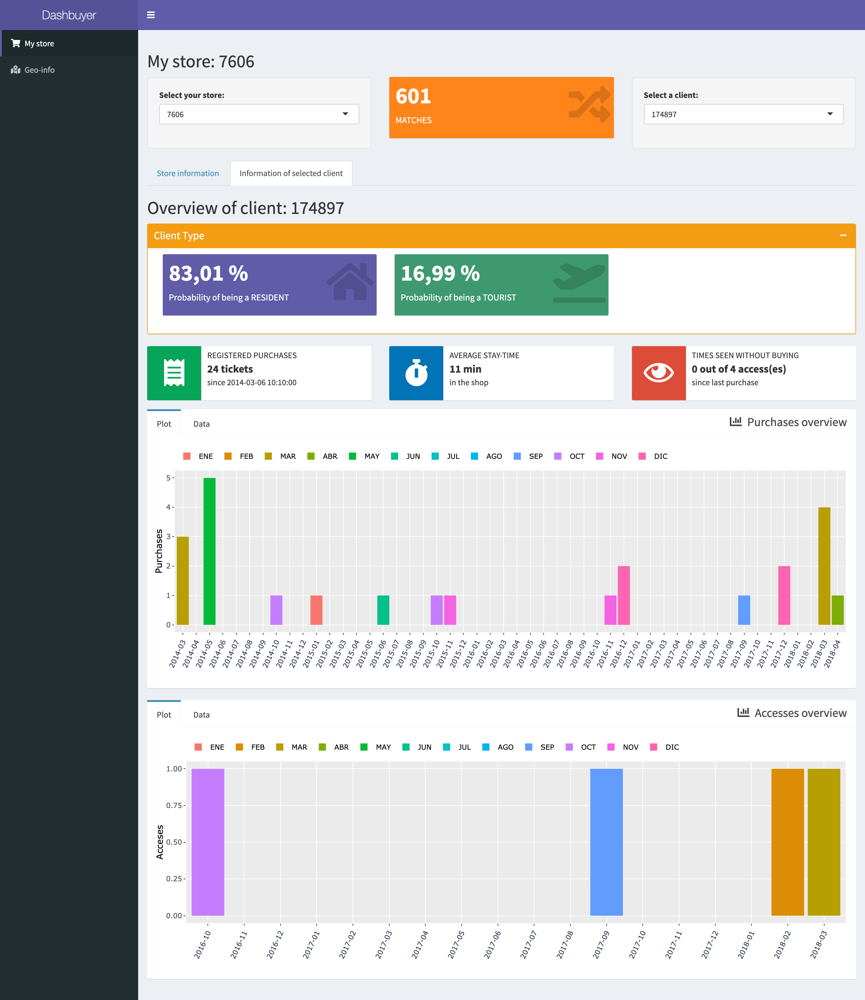
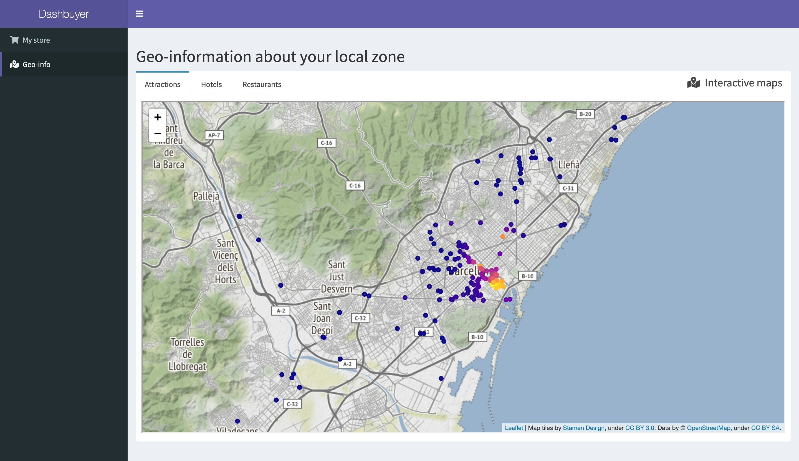

# Dashbuyer

**Front-End of a more in-depth project on CRM matching and customer segmentation, made with the Shiny package from R.**

> *Description*. [...] Dashbuyer is a web application that allows stores to access all records of their locals distributed around the territory. It is a key tool for store managers that allows them to know in depth what are the purchase transactions and the accesses of the flow of customers in the store. The possibilities of the tool in terms of business strategies are endless, but we are very proud to offer two pioneering features that are not found in any competing product. [...]

When testing the dashboard app on your computer:

1. First open the `dashbuyer.Rproj` to see the current R project
2. Open the `dashbuyerApp.R` file and click **Run App** on the upper right corner
3. (if it is the first time setting up the app, maaany libraries will install, just: wait, chill & check everthing is OK)
4. Again, the first time of execution a `/dataframes/` folder will be created within the root directory of the app (also wait a bit)
5. Check that inside the `/dataframes/` folder some RDS files have been created (those are really fast formats of reading dataframes in R, useful for the app)
6. Explore the *Dashbuyer*!

#### 

## Images

#### Store information

#### Information of selected client

#### Geo-information

